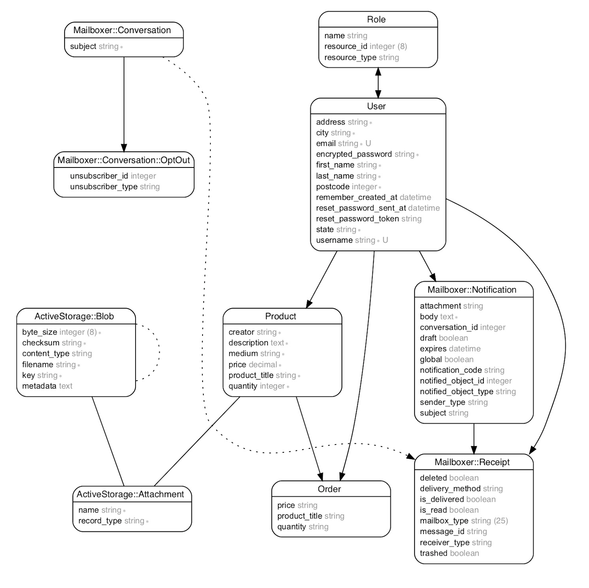
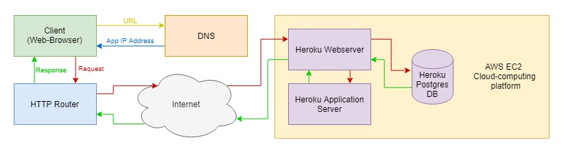
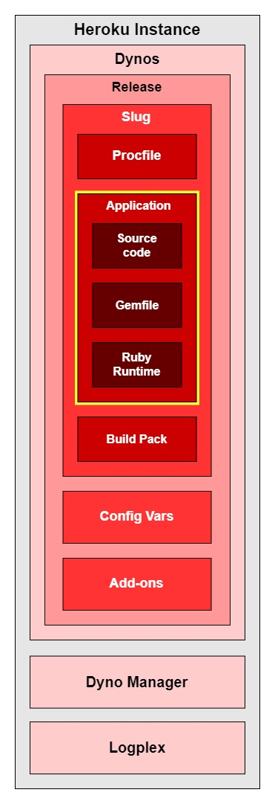

# KraftMe Marketplace App

## Link to published site URL
[Visit the KraftMe application](https://young-scrubland-51531.herokuapp.com)

## Link to GitHub (public)
[Central GitHub Repository](https://github.com/EnFen/kraftme)
## Description of project,including,

### Problem definition / purpose
The purpose of KraftMe is to create a local artist market place - initially focussing on locations within  Australia -  where artists can display, buy and sell their works. 
Consumers will also be able to use the application to view work by local artists,  contact them and/or buy artworks they love,  all on the same platform. 

### Functionality / features
The application allows for the following:
  * User can make accounts and buy and sell artwork
  * User can upload images for artworks that they list on the site
  * User can see their purchase and sales history
  * User can send messages to the sellers of the artworks
  * Admin has a view that allows them to edit and destroy all artworks listed on site
  * Admin has view that allows them to see all transactions on site

## Screenshots


### Tech stack (e.g. html, css, deployment platform, etc)
The following technologies were used in the development and deployment of the KraftMe Marketplace App:
  * Ruby on Rails
  * HTML
  * CSS
  * Git/Github
  * Heroku

### Instructions on how to setup, configure and use your App.
A standard user of the site must first proceed to the [KraftMe Marketplace](https://young-scrubland-51531.herokuapp.com), where they will be able to view all available artworks in the KraftMe gallery. Once they have created a user profile and signed up, they will be able to access and participate in the rest of the website, including posting their own artworks for sale, contacting artists, or making a purchase.
At this time, admin level users must request access from the developers, who will set up the account and then provide the user with an appropriate admin level username and password.

## Design documentation


### Design process 
Our group started by brainstorming ideas for the marketplace, and decided to create an Australian only market place, where users can buy and sell their artworks. The application will be a place where people can find local artists, get in contact with them, buy artwork and also have the option to get their own masterpieces out to the public.  
Then we proceeded with doing the ERD, the user stories, and then started the development. We decided on the MVP features so we can prioritise them first and then identify nice-to-have features that we can work on given the timeline given for the assignment. Development was done via pair and solo programming.

### User stories
User stories were written on to cards on our Trello Board. Progress of our project over time, including how user stories were added, modified, and addressed in the project can be seen [here](./docs/trello_boards)

### A workflow diagram of the user journey/s.


### Wireframes
An example of one of our low-fi wireframes for the KraftMe Marketplace app is shown below:

.jpg)

For a gallery of all of the wireframes we designed for the app, visit [here](./docs/wireframes)

### Database Entity Relationship Diagrams


### Validation
See the processes we used to describe our validation rules for users and products [here](./docs/validation_rules)

## Details of planning process

### Project plan & timeline
A project plan was developed using the 'Due Date' function on Trello cards as a guide for completing product features.
We had 9 days to complete the project, which progressed according to the following timeline:
  ###### Day One
  * Wireframes
  * ERD Design
  * User Stories
  * Assignment of feature priority for MVP
  * Assignment of due dates for high priority features
  * Git flow set up for all team members
  * Initial deployment of Rails to Heroku
  ###### Day Two - Seven
  * Development of KraftMe app functionality & features
  * Addition of styling (minor)
  * Manual and Automated testing of the application in both development and production environments
  ###### Day Eight - Nine
  * Bugfixes
  * Documentation
  * Presentation preparation
  

### Screenshots of Trello board(s)
Our first Trello board showing the expected plan and timeline for developing the KraftMe Marketplace is shown below: 


Trello progress over our project can be found on the rest of our Trello boards [here](./docs/trello_boards)

# Answers to the Short Answer questions

#### 1. What is the need (i.e. challenge) that you will be addressing in your project?
Australian artists need a way to display and sell their work.
An online artists market offers an opportunity to meet this need using current technology, and encourages consumers to find out about, contact, and support their local artists.

#### 2. Identify the problem you’re trying to solve by building this particular marketplace *App*? Why is it a problem that needs solving?
Currently there are online services on the market which will allow consumers to display, sell, view and purchase artwork, including websites such as Pinterest, Etsy and Amazon. The problem with these services is that ‘local’ artists are often lost, and consequently remain unsupported. 
Consumers in Australia are also faced with the problem of distance; at a practical level this means they have to factor in the shipping and packing of art (and other costs), but at a more personal level it also means that they remain unfamiliar with the artists and creators of the works they purchase.

#### 3. Describe the project will you be conducting and how. your *App* will address the needs.
The purpose of KraftMe is to create a local artist market place - initially focussing on locations within  Australia -  where artists can display, buy and sell their works. 
Consumers will also be able to use the application to view work by local artists,  contact them and/or buy artworks they love,  all on the same platform. 

#### 4. Describe the network infrastructure the *App* may be based on.
Kraftme is a client-server web application running over HTTP.
The first major part of the network infrastructure is a client – which for our app will most often be a user web browser. Upon entering the URL for the Kraftme application, the client will verify the IP address by referencing a Domain Name Server (DNS). HTTP requests and responses are handled through a router which is connected to the internet.
Using the IP obtained from the DNS, the clients request is issued to a Heroku Webserver (all of Heroku’s services are hosted on the AWS EC2 cloud-computing platform). The webserver then constructs the desired response by pulling required content from Heroku application Servers and Heroku Postgres Database, and once completed, the content is served back to the client.
All of the major network infrastructure components described have been illustrated in the following diagram:



*References:*

*En.wikipedia.org. (2018). Heroku. [online] Available at: https://en.wikipedia.org/wiki/Heroku  [Accessed 7 Nov. 2018].

*Spacey, J. (2018). What is Network Infrastructure?. [online] Simplicable. Available at: https://simplicable.com/new/network-infrastructure  [Accessed 7 Nov. 2018].


#### 5. Identify and describe the software to be used in your *App.*
KraftMe uses the Ruby on Rails (Rails) MVC web framework as its core software.
Rails includes several out-of-the-box software dependencies, or gems, including:
  * Puma – a Ruby webserver
  * Pg – a Ruby interface for PostgreSQL RDBMS utilising SQL
  * Turbolinks – for optimising web application linking speeds
  * JBuilder – provides a domain specific language for building JSON API’s
  * Bootsnap – caching application for reducing boot times
  * Asset pipeline libraries, including SaSS for Rails, which provides our app with the ability to use scss stylesheets, and also Uglifier and CoffeeScript for Rails, which allow for JavaScript compression and transcompilation respectively.
  * Development aids such as ByeBug, Web Console, and Spring which made debugging, and app construction much easier.
  Non standard gems which were added to the app to aid functionality included:
  * Devise - used to aid user sign in and authentication
  * Rolify - used to assign and confirm authorisation levels of users
  * Mailboxer - used for messaging between users
  * RSpec - used for development of automated tests
  * Bootstrap - used for styling rules across the site

In addition to Rails, KraftMe employs the standard front-end web technologies, HTML5, CSS3, and Javascript
 
*References:*

*Deveiate.org. (2018). PG: The Ruby PostgreSQL Driver. [online] Available at: https://deveiate.org/code/pg/  [Accessed 7 Nov. 2018].

*GitHub. (2018). puma/puma. [online] Available at: https://github.com/puma/puma  [Accessed 7 Nov. 2018].

*GitHub. (2018). rails/coffee-rails. [online] Available at: https://github.com/rails/coffee-rails  [Accessed 7 Nov. 2018].

*GitHub. (2018). rails/jbuilder. [online] Available at: https://github.com/rails/jbuilder#jbuilder  [Accessed 7 Nov. 2018].

*GitHub. (2018). rails/sass-rails. [online] Available at: https://github.com/rails/sass-rails  [Accessed 7 Nov. 2018].

*GitHub. (2018). rails/spring. [online] Available at: https://github.com/rails/spring  [Accessed 7 Nov. 2018].

*GitHub. (2018). rails/web-console. [online] Available at: https://github.com/rails/web-console  [Accessed 7 Nov. 2018].

*GitHub. (2018). turbolinks/turbolinks. [online] Available at: https://github.com/turbolinks/turbolinks  [Accessed 7 Nov. 2018].

*Guides.rubyonrails.org. (2018). Ruby on Rails Guides. [online] Available at: https://guides.rubyonrails.org/index.html  [Accessed 7 Nov. 2018].

*Rubydoc.info. (2018). File: README — Documentation for bootsnap (1.1.7). [online] Available at: https://www.rubydoc.info/gems/bootsnap/1.1.7  [Accessed 7 Nov. 2018].

*Rubydoc.info. (2018). File: README — Documentation for uglifier (4.1.19). [online] Available at: https://www.rubydoc.info/gems/uglifier/  [Accessed 7 Nov. 2018].

*Rubydoc.info. (2018). File: README — Documentation for byebug (5.0.0). [online] Available at: https://www.rubydoc.info/gems/byebug/5.0.0  [Accessed 7 Nov. 2018].

*GitHub. (2018). mailboxer/mailboxer. [online] Available at: https://github.com/mailboxer/mailboxer  [Accessed 8 Nov. 2018].

*GitHub. (2018). plataformatec/devise. [online] Available at: https://github.com/plataformatec/devise  [Accessed 8 Nov. 2018].

*GitHub. (2018). RolifyCommunity/rolify. [online] Available at: https://github.com/RolifyCommunity/rolify  [Accessed 8 Nov. 2018].

*GitHub. (2018). rspec/rspec-rails. [online] Available at: https://github.com/rspec/rspec-rails  [Accessed 8 Nov. 2018].

*GitHub. (2018). twbs/bootstrap-rubygem. [online] Available at: https://github.com/twbs/bootstrap-rubygem  [Accessed 8 Nov. 2018].


#### 6. Identify the database to be used in your *App* and provide a justification for your choice.
We used PostgreSQL Relational Database Management System (RDBMS) for KraftMe, which is a Structured Query Language (SQL) database manager.
The main reason for choosing this database was that we knew we were going to be deploying to Heroku, and Heroku recommends the Heroku Postgres system for websites deployed to their platform. Heroku Postgres is a cloud-based implementation of PostgreSQL, and includes continuous protection (through encryption), high availability, and rollback options as a part of their service.
Other factors which influenced our choice of PostgreSQL include the fact that it is Free and Open Source Software (FOSS), but is very popular, well tested, and strongly supported. It is also highly extensible and designed for scalability, making it suitable for use as our app grows.
In order to identify and/or minimise conflicts which could occur in the production environment, we also used PostgreSQL while developing our app.

*References:*

*2ndquadrant.com. (2018). PostgreSQL vs MySQL | 2ndQuadrant. [online] Available at: https://www.2ndquadrant.com/en/postgresql/postgresql-vs-mysql/  [Accessed 7 Nov. 2018].

*Devcenter.heroku.com. (2018). Heroku Postgres | Heroku Dev Center. [online] Available at: https://devcenter.heroku.com/articles/heroku-postgresql  [Accessed 7 Nov. 2018].

#### 7. Identify and describe the production database setup (i.e. postgres instance).
To set up our production database on Heroku, we first confirmed that the ‘pg’ ruby gem was installed in our applications ‘Gemfile’, and that all dependencies were resolved using ‘bundle install’.
Next we allocated the appropriate production environment variables in our ‘database.yml’ file. For our app, these were as follows:
```
production:
adapter: postgresql
encoding: unicode
pool: 5
database: kraftme_production
username: kraftme
password: <%= ENV['KRAFTME_DATABASE_PASSWORD'] %>
```
This ‘database.yml’ file, and the variables set within it were recreated on Heroku upon deployment of our application, and the Heroku server parsed the file to create a single DATABASE_URL variable, which contains all the database connection and setup information.  
As our app runs, it is this DATABASE_URL variable which maintains the connection and subsequent transfer of data between our app and the postgres instance on the Heroku Postgres database.

*References:

*Devcenter.heroku.com. (2018). Heroku Postgres | Heroku Dev Center. [online] Available at: https://devcenter.heroku.com/articles/heroku-postgresql#connecting-in-ruby  [Accessed 7 Nov. 2018].

*Devcenter.heroku.com. (2018). Heroku Ruby Support | Heroku Dev Center. [online] Available at: https://devcenter.heroku.com/articles/ruby-support#build-behavior  [Accessed 7 Nov. 2018].

*Guides.rubyonrails.org. (2018). Configuring Rails Applications — Ruby on Rails Guides. [online] Available at: https://guides.rubyonrails.org/configuring.html#configuring-a-database  [Accessed 7 Nov. 2018].

#### 8. Describe the architecture of your *App*.
Our KraftMe application was deployed to Heroku using Git, where it is added to the standard Heroku platform architecture.
This architecture can be best described by referring to the following diagram:



The App itself consists of three architectural components; the source code, the gemfile (dependencies), and the Ruby runtime. 
The Build pack bundles together itself, all of the App components, and a list of instructions for running the app called a Procfile, into another component known as a Slug. A new Slug will be created each time any of the components it contains are changed or re-deployed.
Next, the Slug is combined with the production environment Config Variables, and any other Add-ons to create a Release of the App. A new Release will be issued any time any of its contained components are changed.
Dynos are discrete processing units which are where the KraftMe application actually runs. 
More dynos - each running a copy of the app - can be added as resource needs of the application scale. each time a new version of the app is deployed, all currently executing dynos are killed and a new dyno formation is issued. Dynos can run various commands as issued in the Procfile. Multiple dynos given the ‘web’ command will balance HTTP requests between them.
A Dyno Manager, and a Logplex complete the full Heroku instance. These are respectively responsible for running and maintaining the dyno formations, and keeping the dyno logs.

*References:*

*Devcenter.heroku.com. (2018). Heroku Architecture | Heroku Dev Center. [online] Available at: https://devcenter.heroku.com/categories/heroku-architecture  [Accessed 7 Nov. 2018].

*Devcenter.heroku.com. (2018). How Heroku Works | Heroku Dev Center. [online] Available at: https://devcenter.heroku.com/articles/how-heroku-works  [Accessed 7 Nov. 2018].

*En.wikipedia.org. (2018). Heroku. [online] Available at: https://en.wikipedia.org/wiki/Heroku  [Accessed 7 Nov. 2018].

#### 9. Explain the different high-level components (abstractions) in your *App*.
**Models** - these describe the data that will be used in our app, as well as their types, and constraints. All data sent to and from the database is managed by the models. For the KraftMe app these include
*Users* - used manage data about users of the app
*Products* - used to manage data about the artworks being sold on the site
*Orders* - used to record data about transactions
*Roles* - used to store data about roles, used for authorisation
*Conversations* - used to store data about messages sent between users (handled by the mailboxer gem)

**Controllers** - these describe how certain requests and responses are directed around our app, including the information that will be sent along with that action.
*Users* - used to direct a user to pages which allow them to add or edit their profile (handled by the Devise gem)
*Products* - used to direct users to a variety of pages where they can view, create, edit, or delete artwork
*Orders* - used to direct users to pages that show their order or sales histories
*Charges* - used to direct a user to pages that handle payments (managed by the Stripe gem)
*Messages* - used to add content within a conversations
*Conversations* - used to direct users to pages where they can initiate or view conversations

**Views** - these represent the data or other information that is shown to a user of our app. There are many different types of views, most of which reflect requests or responses from the controllers. Some examples of these include (but are not limited to):
Showing a list (index) of all artworks available for sale on the app
  - Allowing users to create or update their account
  - Showing detailed information about an individual artwork
  - Allowing users to create messages to other users
  - Allowing users to enter their details to pay for an artwork
  - Showing users a history of their purchases or sales

#### 10. Detail any third party services that your *App* will use.
  * **Heroku** - used for the app deployment. Heroku is a cloud platform that lets companies build, deliver, monitor and scale apps.
  * **Stripe** - used to process payments from users. Stripe is a payment platform application to manage revenue and the cloud infrastructure provides reliability.
  * **Cloudinary** - we used cloudinary for image file uploads. Cloudinary offers an incredibly feature-rich image and video platform. It allows to securely upload & store as many images and videos as needed, at any scale, from any source. It also uses a powerful API for fast upload directly from users’ browsers or mobile apps. 


#### 11. Describe (in general terms) the data structure of marketplace apps that are similar to your own (e.g. eBay, Airbnb).
  * **Etsy** has Users, Items, Favourites, Conversations, Cart, Purchases, Reviews and Shop. You need to open a shop to be able to post items for sale. Items are also organized in Categories and Subcategories.
  * **Ebay** has Users, Items, Bids/Offers, Purchase History, Watching, Saved Searches, Saved Sellers, and Messages. Items are also categorized in Categories and Subcategories.
  * **Gumtree** has Users, Ads, Messages, Watchlist. Ads are also categorized in Categories and Subcategories. 


#### 12. Discuss the database relations to be implemented.
**User** is used as a foreign key for most of the other tables in the database. 
It is used as a foreign key for **Role**, with a *has and belongs to many* relationship. 

**User** is also used as a foreign key for **Product**, which *belongs to* **User**. **User** has a *one to many* relationship with **Product**.

**Product** is used as a foreign key for **Order**, which *belongs to* **Product**. **Order** also has **User** as foreign key, used as both Buyer and Seller IDs. 


#### 13. Describe your project’s models in terms of the relationships (active record associations) they have with each other.
  * **User** - has many products, has many Buy and Sell orders under Order, has and belongs to many Roles.
  * **Product** - belongs to User, has many Orders
  * **Orders** - belongs to Product, belongs to Buyer and Seller referenced from User
  * **Role** - belongs to and has many relationships to User


#### 14. Provide your database schema design.
The ERD for the KraftMe Marketplace application can be found [here](./docs/erd/kraftme_erd.png)

#### 15. Provide User stories for your *App*.
User stories were written on to cards on our Trello Board. Progress of our project over time, including how user stories were added, modified, and addressed in the project can be seen [here](./docs/trello_boards)

#### 16. Provide Wireframes for your *App*.
A gallery of all of the wireframes we designed for the KraftMe app can be found [here](./docs/wireframes)

#### 17. Describe the way tasks are allocated and tracked in your project.

#### 18. Discuss how Agile methodology is being implemented in your project.

#### 19. Provide an overview and description of your Source control process.

#### 20. Provide an overview and description of your Testing process.

#### 21. Discuss and analyse requirements related to information system security.

#### 22. Discuss methods you will use to protect information and data.

#### 23. Research what your legal obligations are in relation to handling user data.


